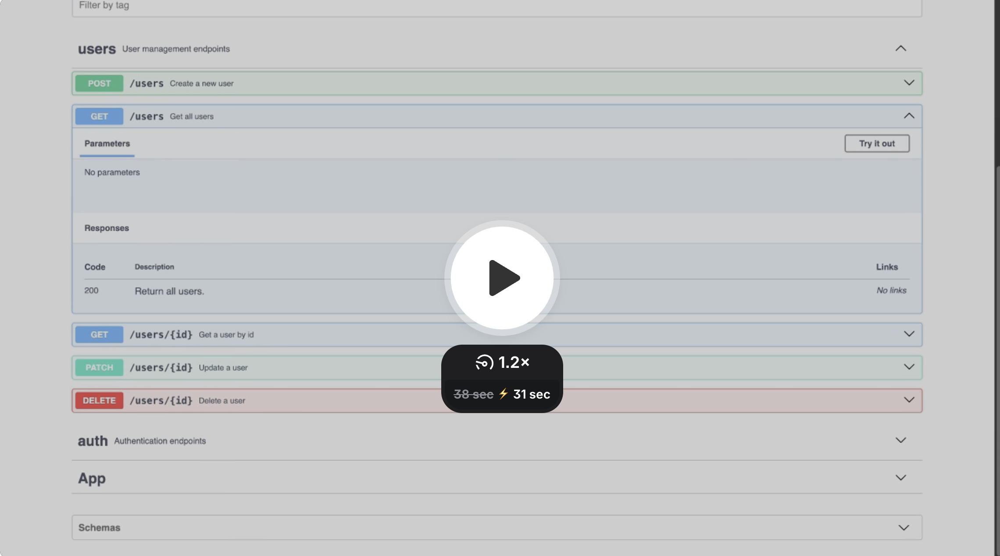

# NestJS User API with Prisma and SQLite

A simple REST API built with **NestJS** and **Prisma ORM**, using **SQLite** for development. Includes full CRUD operations and Swagger documentation—ideal for take-home assignments or starter backend projects.


## 🎥 Demo

[](https://www.loom.com/share/926632a6d1f243c598791c7bd7444899?sid=6a71e698-da6e-499e-bc95-d0293380a3f5)


## Prerequisites

- Node.js (v14 or higher)
- npm or yarn

## Setup

1. Install dependencies:
```bash
npm install
```

2. Create a `.env` file in the root directory with the following content:
```
DATABASE_URL="file:./dev.db"
```

3. Initialize the database:
```bash
npx prisma migrate dev
```

4. Generate Prisma client:
```bash
npx prisma generate
```

## Running the Application

Development mode:
```bash
npm run start:dev
```

Production mode:
```bash
npm run build
npm run start:prod
```

## API Documentation with Swagger

The API documentation is available through Swagger UI at:
```
http://localhost:3000/api
```

### Features
- Interactive API documentation
- Try out API endpoints directly from the browser
- View request/response schemas
- See validation rules and examples
- Test API endpoints with different parameters

### Using Swagger UI
1. Open `http://localhost:3000/api` in your browser
2. You'll see all available endpoints grouped by tags
3. Click on any endpoint to expand its details
4. Click "Try it out" to test the endpoint
5. Fill in the required parameters and request body
6. Click "Execute" to send the request
7. View the response and status code


### Validation Rules
The API includes automatic request validation:
- User name must be at least 2 characters long
- Email must be in a valid format
- All required fields must be provided
- Invalid requests will return 400 Bad Request with validation errors

## Database Management

### Prisma Studio
To view and manage your database through a web interface, run:
```bash
npx prisma studio
```
This will open Prisma Studio at http://localhost:5555, where you can:
- View all records in your database
- Add, edit, and delete records
- Filter and sort data
- View relationships between tables

### Database Location
The SQLite database file is located at:
```
./prisma/dev.db
```

## API Endpoints

The API will be available at `http://localhost:3000`

### Users

- `POST /users` - Create a new user
  ```json
  {
    "name": "John Doe",
    "email": "john@example.com"
  }
  ```
  > Note: Email addresses must be unique. Attempting to create a user with an existing email will result in an error.

- `GET /users` - Get all users

- `GET /users/:id` - Get a user by ID

- `PATCH /users/:id` - Update a user
  ```json
  {
    "name": "Updated Name",
    "email": "updated@example.com"
  }
  ```
  > Note: When updating a user's email, the new email must be unique if provided.

- `DELETE /users/:id` - Delete a user

## Usage Examples

### Create a User
```bash
curl -X POST http://localhost:3000/users \
  -H "Content-Type: application/json" \
  -d '{"name": "Mike", "email": "mike@example.com"}'
```

### Get All Users
```bash
curl -X GET http://localhost:3000/users
```

### Get User by ID
```bash
curl -X GET http://localhost:3000/users/1
```

### Update a User
```bash
curl -X PATCH http://localhost:3000/users/1 \
  -H "Content-Type: application/json" \
  -d '{"name": "Mike Updated", "email": "mike.updated@example.com"}'
```

### Delete a User
```bash
curl -X DELETE http://localhost:3000/users/1
```

## Development

- The application uses SQLite as the database, which is stored in `dev.db`
- Prisma is used as the ORM for database operations
- The API follows RESTful principles
- TypeScript is used for type safety
- Email addresses are enforced to be unique across all users
- Swagger UI provides interactive API documentation
- Request validation is handled automatically using class-validator

## Testing

Run the test suite:
```bash
npm run test
```

Run e2e tests:
```bash
npm run test:e2e
```
